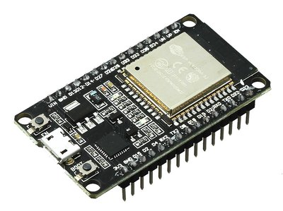
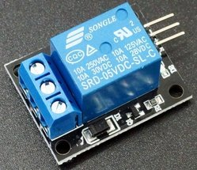

# Automatic School Bell Timer

The Project is based on the popoular ESP32 boards.

PHOTO BOX - PHOTO materials

## WARNING
Most electromechanical school bells use mains voltage (230/110V). The project can be assembled, without connecting to mains power. However when installing to the final location a connection has to be made to the bell.
**WORKING WITH MAINS VOLTAGE IS VERY DANGEROUS. KEEP ALL PRECAUTIONS AND DO IT AT YOUR OWN RISK.** Ask a licenced tecnician to do the mains connection.

## Problems with existing solutions
- Very limited number of timers usually smaller than the 14-20 a school needs.
- Hard to use control panel.
- Severe time drift. This basically means constant maintenance and/or that the bell never rings at the expected time. A few minutes/even seconds error does not seem to be a problem at first glance, but the real problem is the argument with the students that the time is passed that they are gonna loose the bus etc.
- Not capable of switching to Daylight savings time. Even WIFI plugs have problems on this.
- Computer based solutions suffer from complexity and unreliability. Operating system updates, broken harware, high electricity consumption, audio equipment maintainance, are some of the drawbacks.
- Wall WIFI plugs like TUYA, sonoff etc have almost always the problem with limited number of timers. Not to mention that every one needs a different mobile application, and they can ONLY be controlled by their modile app.
- Especially WIFI plugs cannot be used as **dry contacts** (See **electrical connection**) this alone can be a deal braker.
- Wifi based timers do not have internal battery backed RTC, and without network, will lose the time.
- Limited/No protection from moisture and dust.

## Characteristics of the project
- Very accurate, using NTP(Network Time Protocol). You will never have to set the time.
- Automatically swich to Time Zone and Daylight Savings Time.
- Resistant to Network disconnections and power outages. The module keeps accurate time on such occasions, and only needs to the Internet to fix the time drift (less than 1 sec per week without Internet). We use a dedicated DS3231 module(backed by a lithium coin cell) for this.
- Simple Web Control Panel, via PC or mobile. With the option of MQTT, it can also be monitored and controlled outside of the local network.
- Ability to use more than 1 timetables even different bells (this is rare, see dedicated paragraph)
- As few parts as possible, no PCB, and no soldering at all (if we choose an ESP32 board with presoldered headers).
- Reliable hardware. It is expected to work for years and years to come. The minimal part count and the airtight enclosure is hepling on this.
- Reliable software. Minimal dependencies on external services. It can tolerate power outages and MONTHS of WIFI anavailability before the time drift becomes noticeable. The CR2032 coin cell will probably work for 10 years and probably more (discharges only when not in mains power). There is no dependency for MQTT server, whom we dont now if it is working or even exists years later (see the dedicated section for MQTT).
- Very low cost (See the list with materials below)
- Free software. Both tasmota and the berry script are open source with very permissive licences.

## STEP 1. Choose an ESP board.
- ESP32 boards are prefered over ESP32-S2 or ESP32-C3. I have witnessed some instability whith C3 : When the ESP32-C3 cannot find an AccessPoint, frequently crashes. It recovers immediatelly but lets stay on the safe side. I am sure the situation will change to the better over time, but for now (2025) the ESP32 is the best choice. The prices of the boards are very low anyway, and there is no cost reason to prefer one over another.
- Another very good point in favor of ESP32 boards, is they always come with a dedicated USB-serial chip (CP2102, CH9102, CH340). Many C3 and S2 boards use USB-serial implemented by the ESP itself, and the Tasmota installation/recovery is unstable, as the board vanishes and reappears on reboots.

The boards that i have tested are :
- ESP32 WROOM-32D devkit boards, 30 and 36 pin versions. Very popular, presoldered headers, with 5V power pin (You can power a relay whith this) and plenty of GPIO and GND pins. This is the safest option. There is also a screw terminal adapter wich makes the assembly even easier. TODO PHOTO



- ESP32 LOLIN32 Lite. Do not connect a LiPo battery. You can drive an SSR, but no 5V output for a relay. No presoldered headers. Only 1 GND pin, but for the very low power DS3231 we can use GPIO pins as VCC and GND.

We aware
- **ESP8266 will NOT work.** It does not support the Berry scripting language.

## Step 2. Choose the Relay / SSR
Note that I have tested the project only with SSR, however it should work OK with a Relay 5V breakout (not a naked relay which needs a proper circuit and a PCB)


The SSR needs only a GPIO and a GND(Even this can be simulated by a GPIO, so you can choose the most convenient PINs)
Relay breakout Photo TODO



Needs a +5V a GPIO and a GND(not a GPIO)

PHOTO TODO devkit-SSR lolin32-SSR devkit-Relay

old step Relay/SSR selection
Most general purpose timers i have seen use electromechanical relays. For this project you might for example use this one

TODO photo

They work for AC and DC and and A wide range of voltages. They might have problems with inductive loads (electromechanical bells are inductive and apart from real noice produce a lot of electrical noice also !) Probably the quality(contact materials) of the relay plays an importand role here, but this is something I cannot discuss, I dont have the expertice nor the tools to test them.

The other option is to use a Solid State Relay (SSR). They have some adavntages and disadvantages over the electromechanical Relays :
- They work on specific conditions ususally only AC or only DC, and specific votages.
As we are probably speak about mains voltage. You need a ~230V AC SSR like this one
- Generally not well suited for inductive loads. I imagine not all relays are the same, but it is not very easy to know for sure.

TODO PHOTO

- They do not need power(+5V) only GND+A GPIO PIN
- If they used inside specifications they can have a very long life.
- Triac based AC solid relays are very well suited for inductive loads.
- Cannot completly cut the power, allowing some mA to leak. For electromechanical bells this is OK, but I dont know about other types. Also check if this tiny mA leak has some safety implications, altrough it is very small to pose a threat.

**First we will install all necessary software to the ESP board, test the functionality and only then, we will continue with the hardware assembly**

## STEP 3. Tasmota installation & configuration.
This is a very short and limited installation guide, for more info go to the Tasmota installation page.

Do not assemble anything yet, just connect the board with the USB cable to your computer. Tasmota supports a very convenient web based installer. You will need google chrome or chromium or similar browser. Linux users may get serial permission error, you have to add yourself to the "dialout" group. You may need to press the boot button when plugging the board to the computer.

- Go to https://tasmota.github.io/install/
The first option tasmota(english) is the safest option. Localized versions have limited hardware support(only ESP32 variants).
- Press the connect button → choose the serial port → check "Erase Device" → Next → Install
- After the installation is complete press Next → Configure WIFI.

  Use the current WIFI for now. When we move to the final location we can easily move to the new Access Point.

- When connected, click Visit Device.
  Write down the IP address. This is the web page of the tasmota system. It is accessible only from the LAN.
  
  From now on we are working via network. There is no need for the serial connection anymore.

- Set the TimeZone/Dayligtht settings.

  To do this, in another tab go to

  https://tasmota.github.io/docs/Timezone-Table/
  
  Copy the necessary line and execute it in Tools → Console.(NOT berry console)

  You will see the time is changing automatically to your local time.

- Again in console (and dont forget the "backlog")
  ```berry
  backlog hostname school; SetOption55 1; restart 1;
  ```
  On boot messages, you will see something like
  ```
  mDN: Initialized 'school.local'
  ```
  From now on you can type "school.local" in the browser address instead of the IP. This is not very reliable unfortunatelly, keep also the IP.

## STEP 4. Berry script installation ("timetable.be")
Do not forget that the SSR or the Relay breeakout is already connected to the ESP.
Do not connect the RELAY/SSR output to anything yet !!!!!!!!!!!!
Both have a LED so we can visually check

TODO Photo

WebBrowser → IP address(or school.local) → tools → Berry scripting console

paste the following code
TODO use timetable.be

```berry
do
  var fn = 'ds3231.be'
  var cl = webclient()
  var url = 'https://raw.githubusercontent.com/pkarsy/TasmotaBerryTime/refs/heads/main/ds3231/' + fn
  cl.begin(url)
  if cl.GET() != 200 print('Error getting', fn) return end
  var s = cl.get_string()
  cl.close()
  var f = open('/'+fn, 'w')
  f.write(s)
  f.close()
  print('Installed', fn)
end
```

Now you have the "timetable.be" script installed.

Without leaving the Berry Console type

```berry
TTPIN = 12
load('timetable.be')
```

You will see the timetable starting successfully. To be started on boot, it needs to be in "autoexec.be"

tools → Manage filesystem → edit autoexec.be (the white icon with the pencil). Or create it if does not exist.

Append the 2 lines.
```berry
TTPIN = 12
load('timetable.be')
```

restart the module

Go with the browser to the same IP address(or school.local) as previously. You will see a "Timetable" button on top, for testing you can choose a time very close to the current time. When testing choose * (=ALL) for active days. On school, most probably the setting will be 1-5 (Monday-Friday).

## STEP 5. Connecting the DS3231 real time clock to the board.
Without a real time clock it is easy for the module to lose the time. Example is a power outage, followed by Internet disconnection (The power outage affects the network equipment). Or a WIFI password change (Without updating our project). With the RTC, the module will continue to work for a long time, until we fix the problem. Full instrctions on:

https://github.com/pkarsy/TasmotaBerryTime/tree/main/ds3231

## STEP 7. Collecting the rest of the hardware.
PHOTO-TODO
- A project enclosure, better to be air tight, to prevent moisture and dust. 
- Esp32x board + DS3231 + USB cable (from the previous steps). DO NOT USE A 2 CHARGING ONLY CABLE. You will not have any means to recover the system from WIFI changes.
- A few jumper cables (Warning Use only completely new cables generally are very fragile.`)
- Alternativelly a screw terminal breakout and simple copper wires. PHOTO
- SSR (solid state relay) Or a Relay breakout module. I personally use an SSR. TODO own section WARNING SSR cannot completely break the circuit and allows for a few mA to leak even when inactive.
- A usb charger. No need to be powerful, but it helps to be of good quality, for example from an old phone.
- A connector for the bell connection.
- ON/OFF button
- Optionally an indicator LED. You can bye them ready with cables and resistor, or solder one yourself. See the dedicated paragraph on how to install it.

## STEP 8. Assembling the circuit
the ESP32 is already connected with the DS3231
now locate the GPIO and the GND pins and connect the SSR with the board
For a relay breakout you will need the 5V output also. TODO PHOTO
For the usb cable you will neet to open a hole and then use some Hot glue or UV-glue or
even better a screw form aliexepress etc. some gummy to fix it
TODO photo

## STEP 9. protect the web interface from anauthorized access

Here are 2 solutions. Use both of them if you prefer.

- Set a Web` Admin Password to access the page. school.local(or IP) → Configuration → Other → Web Admin Password (Login with "admin"/"password"). The page is not encrypted so not very secure, but it is on LAN only so I guess is OK.

- Automatically disable the webserver 5min after powerup. When you need to access the web interface, unplug the power and connect again. Not very secure, but it has the huge advantage of not having another password to remember (after 10 years), and this project is about reliability and maintainability. You can add a note on the back of the box (see section recovery)
Paste this long line to the Tasmota Console:

```
backlog savedata 0; Rule1 ON Wifi#Connected DO webserver 2 ENDON ON Wifi#Connected DO RuleTimer1 300 ENDON ON Rules#Timer=1 DO webserver 0 ENDON; rule1 1; restart 1;
```

"savedata 0" means the settings changes are not saved automatically from now on, and need a manual restart to be saved. This does not harm our project and in fact prevents flash wear.

## STEP 10. Intall the electrical connector (near the manual bell switch)
PHOTO
Most probably the school already has a circuit for the bell, and a wall button for manual ringing. In that case the most straitforward way is to install the connector 2 cables at the 2 poles of the switch. With this **dry contact** configuration the Bell rings whenever the SSR/Relay is activated. There is no need to uninstall the old timer (if exists), just disable it.

## STEP 9. Plug the Timer connector in the newly installed connector.
Make sure that there is a wall electrical socket for the usb charger **DEDICATED** for this purpose. You do not want someone unpluging the timer, to charge a mobile phone or whatever.

## STEP 10. Reconfigure WIFI to use the AP at school.

**Plug the USB cable to you laptop** (chromium based browser) and search for "tasmota installation" We will use the same tasmota installer.
type Connect and choose the port.

You can try Configure WIFI but it is unreliable at this point(is searching for the old AP)  → Configure WIFI → select the new Access Point + type the pass → Visit Device.
"Configure Wifi" does not work always. The following seems to be very Reliable

The most reliable way is to use the Logs & Console

backlog ssid1 MyNewAP; password1 MyNewPassword;

Do not forget the "backlog" and the 2 ";"

Wait the module to reset and wait to see if connection works.

Unplug the cable from the laptop and use the USB charger.


## STEP 11. DO NOT SKIP THIS ! Document the previous to a paper and/or to an online note app(keep etc.) how to recover from a missing/changed Access Point. This way even someone else can do it instead of you.
The same method can be used if the module is connected to the WIFI but you cant find the IP address and the "school.local" is not working.
You will probably want to put this ins some accessible place, or to the back of the box.

Congratulations !

Optional stuff some of them may be of interest to you.

### How to power OFF the module
Unplug the USB charger. The ON/OFF button as we have seen, only disables the output of the SSR or Relay.

### How to disable the bell by software.
DONT DO IT. the idea for this Timer is to be used by any person/teacher in the school. Use the ON/OFF button for this task. If you really insist on doing this by software, set the duration to 0. But then the ON/OFF button will not work and probably the timer seems to be broken to the other users of the bell.

### More than 1 timetable/bells
in autoexec.be we can
```sh
TTPIN = 12
TTPIN2 = 12 # Can be the same or different pin
load('timetable')
```
The second timetable can be for example for some special class on Friday afternoon

If you need to ring a diferent bell you have to install a second SSR. TTPIN2 must be set accordingly.<br>
TTPIN3 TTPIN4 also work.

### Optional indicator LED
You need something like this

TODO photo

You have to install the black female 2.54 connectors yourself (unless you use a screw terminal breakout)
The LED is controlled entirelly by the tasmota system not by "timetable.be". For the LED+ you can use any GPIO pin and for the LED- a free GND or a GPIO(configured as GND)
Configure :
```sh
LED+ ledlink (i)nverted
LED- Onboard GND or Output Low(=low power GND)
```
### Disable Device Recovery (Recommended)
Go to Tools → Console
```
backlog SetOption65 1; restart 1;
```
Device Recovery may be useful when we are playing with tasmota, but not on a working device.

### MQTT server, optional but useful for debugging or remote control
Altrough you can self host your MQTT server, there are a lot of online MQTT servers free and paid and probably you prefer this for simplicity. Examples are:
- hivemqtt.com
- flespi.com

You must use the TLS connection, all online servers support secure connections.

You will also need an mqtt-client such as:

- MQTT-Explorer
- MQTTX
- (lots of terminal clients)
- (android clients)
- (android termux clients)

In tasmota console:
```sh
backlog 
```

| publish topic | payload       | action |
| ------------- | ------------- | ----- |
| cmnd/mybell/br | bell_on() | rings the bell |
| cmnd/mybell/br | tt.timetable | shows the timetable |
| cmnd/mybell/br | tt.set_timetable("1000 1045")| sets the timetable |
| cmnd/mybell/br | tt.duration | shows the duration |
| cmnd/mybell/br | tt.set_duration(5) | sets the duration |
| cmnd/mybell/br | tt.active_days | shows the active days |
| cmnd/mybell/br | tt.set_active_days("1-5") | set the active days |

There are a lot of mqtt GUI apps on mobile(and Web) allowing to automate theese commands with buttons if you need this, but I think is overkill, given how rarelly you need to change the settings

### Do I need to update the tasmota system ?
Probably not. If it is working, dont fix it. The same applies for the berry script.

### Why not using the buildin tasmota timers
They are not very convenient for this specific application. Also there are cases ( schools with day+afternoon timetable) where the available timers are not enough. The "timetable.be" script offers an unlimited number of timers and a relatively easy to use web interface.

### 5Ghz wifi. Currrently not working
At the moment all Tasmota supported ESP chips only work with WIFI 2.4 GHz. This is acceptable, as most Access Points support 2.4 GHz and 5GHz at the same time. When the Tasmota system supports 5GHz, for example ESP32-C6, I guess it will be trivial to use the new chip, and if I can, I will try to update this page.

### Why Tasmota and not an embeded programming language (Arduino, micropython circuitpyton, lua or even ESP-IDF) ?
Tasmota solves for us some very important aspects of the project. Implementing all theese features in bare metal will be very difficult and time consuming.

- Network connectivity (this includes WIFI autoconnect, optionally MQTT client autoconnect)
- A customizable web server, which allows us to create a dedicated page for the timetable.
- Time Zone and Daylight Time Switching
- Easy control of peripherals.
- filesystem and settings storage.
- a scripting language, the excellent Berry Language. The automation of the bell and the webserver customizations are written in this language.
- Easy realtime clock connection (DS3231).
- An excellent web based installer. No software is needed for installation (only a chrome based browser) and is working the same on all operating systems.
- MOST IMPORTANTLY ! Easy recovery and changing the WIFI credentials using the same tasmota web installer (or any serial terminal if you prefer).
