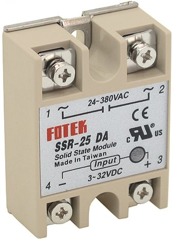

# Automatic School Bell Timer
DO NOT DOWNLOAD ANYTHING YET AFTER 1-2 DAYS THIS MESSAGE WILL BE REMOVED


### WARNING
**WORKING WITH MAINS VOLTAGE IS VERY DANGEROUS. KEEP ALL PRECAUTIONS AND DO IT AT YOUR OWN RISK.** Ask a licenced technician to do the mains connection.

### Goals
- Very accurate, using NTP(Network Time Protocol). This also means that the time never needs to be set manually.
- Time Zone and Automatic Daylight Savings Time.
- Resistant to Network disconnections and power outages. The module keeps accurate time on such occasions, and only needs to connect the Internet to fix the time drift (less than 1 sec per week without Internet). We use a dedicated DS3231 module(backed by a lithium coin cell) for this.
- Easy to control via PC or mobile.
- With the option of MQTT, it can also be monitored and controlled outside of the local network.
- Ability to use more than 1 timetables even different bells (see dedicated paragraph)
- As few parts as possible, no PCB, and no soldering at all (if we choose an ESP32 board with presoldered headers).
- Reliable hardware. It is expected to work for years and years to come. The minimal part count and the airtight enclosure is hepling on this.
- Reliable software. Minimal dependencies on external services. It can tolerate power outages and MONTHS of WIFI anavailability before the time drift becomes noticeable. The CR2032 coin cell will probably work for 10 years and probably more (discharges only when not in mains power). There is no dependency for MQTT server, whom we dont now if it is working or even exists years later (see the dedicated section for MQTT).
- Very low cost (See the list with materials below)
- Free software. Both tasmota and the berry script are open source with very permissive licences.

### STEP 1. Connect the electronic parts just the schematic in the start of the page
The instructions and the pinout are for the DEVkit-30pin board(is ESP32 based). For other boards see the dedicated section below. A [terminal adapter](https://duckduckgo.com/?q=esp32+screw+terminal+adapter&t=lm&iar=images&iax=images&ia=images) can make the assembly evan easier. As you can see we need the ESP32 devkit board, a DS3231 module and an SSR, and a quality USB **DATA** cable.

Note that I only have tested (and I have tested it for years) the project with o [FOTEK Solid state relay](https://duckduckgo.com/?q=fotek+ssr&t=h_&iar=images&iax=images&ia=images). It should work with a Relay 5V breakout (Not tested). See the dedicated section Relays and SSR for more info.

### STEP 2. Tasmota installation.
This is a very short and limited installation guide, for more info go to the Tasmota installation page.

Connect the ESP board with the USB cable to your computer. Tasmota supports a very convenient web based installer, so no need to install anything in your computer apart from the browser. **You may need to press the boot button when plugging the board to the computer.** Linux users may get serial permission error, you have to add yourself to the "dialout" group.

- Go to https://tasmota.github.io/install/ (Or simply search for "tasmota intaller")
The first option tasmota(english) is the safest option.
- Press the connect button → choose the serial port → check "Erase Device" → Next → Install (Dont forget the boot button it might needed)
- After the installation is complete press Next → Configure WIFI.

  Use the current WIFI, even if it is going to be different at the end. When we move to the final location we can easily change the Access Point.

- When connected, click Visit Device.
  Write down the IP address. This is the web page of the tasmota system. It is accessible only from the LAN.
  
  From now on we are working via the browser. There is no need for the serial connection anymore. Disconnect the cable from the computer and use a USB charger instead.

- Set the TimeZone/Dayligtht settings.

  To do this, in **another tab** go to

  https://tasmota.github.io/docs/Timezone-Table/
  
  Copy the necessary line and execute it in Tools → Console. (NOT berry console)

  You will see the time changing to your local time.

- Again in console (and dont forget the "backlog")
  ```berry
  backlog hostname school; SetOption55 1; restart 1;
  ```
  On boot messages, you will see something like
  ```
  mDN: Initialized 'school.local'
  ```
  From now on you can type "school.local" in the browser address bar instead of the IP. This is not very reliable unfortunatelly, keep also the IP.

###  Step 3. Pin configuration
WebBrowser → IP address (or school.local) → Configure → Module

For boards other than DevKit of course you need to adapt the pin configurtion. As you can see we have used D14 and D27 to power the DS3231. The DS3231 needs only 4mA and the ESP32 can give 30mA or more per pin. This way we can make the board connection very easy (We can even solder the DS3231 if we wanted to).

```
#### For the DS3231 module #########
GPIO 14 -> OutputLow (acts as GND)
GPIO 27 -> OutputHi  (acts as VCC)
GPIO 26 -> I2C SDA
GPIO 25 -> I2C SCL

#### For the indicating LED #####
GPIO 15(D15) -> LedLink_i
# GND is next to D15
```
WARNING the pin of the SSR(D2) is not set in the configuration. We will set this later on. 

### Step 4. Loading the DS3231 real time clock driver.
Without this it is easy for the module to lose the time, on power outages. Installation instructions on:
[DS3231 Driver](https://github.com/pkarsy/TasmotaBerryTime/tree/main/ds3231)
Basically you save the driver "ds3231.be" in the tasmota filesystem, and you load it automatically using "autoexec.be"

### STEP 4. Berry script installation ("timetable.be")
*** #### DEL Do not connect the RELAY/SSR AC output to anything yet.
Most/all Relays and SSRs have a LED so we can visually check whether they activated without connecting the output (to the bell)

WebBrowser → IP address (or school.local) → tools → Berry scripting console

paste the following code
TODO use timetable.be

```berry
do
  var fn = 'ds3231.be'
  var cl = webclient()
  var url = 'https://raw.githubusercontent.com/pkarsmota32/release/tasmota32-ir.binδy/TasmotaBerryTime/refs/heads/main/ds3231/' + fn
  cl.begin(url)
  if cl.GET() != 200 print('Error getting', fn) return end
  var s = cl.get_string()
  cl.close()
  var f = open('/'+fn, 'w')
  f.write(s)
  f.close()
  print('Installed', fn)
end
```

Now you have the "timetable.be" script installed.

Without leaving the Berry Console, type:

```berry
load('timetable.be')
timetable(2) # We are using pin D2 to control the Relay / SSR
```

You will see the timetable starting successfully using some defaults. To be started on boot, it needs to be in "autoexec.be"

tools → Manage filesystem → edit "autoexec.be" (the white icon with the pencil). Or create it if does not exist.

Append the 2 lines.
```berry
load('ds3231') # From the DS3231 step

load('timetable')
timetable(2) # pin = 2
```

restart the module, and check the console messages.

Go with the browser to the same IP address(or school.local) as previously. You will see a "Timetable" button on top. This is the configuration page. When testing choose * (=ALL) for active days. For real usage, most probably the setting will be 1-5 (Monday-Friday).

### STEP 7. Collecting the rest of the hardware.
PHOTO-TODO
- A project enclosure, better to be air tight, to prevent moisture and dust. 
- A few jumper cables. Use only unused cables. Even slightly used cables can be ureliable.
- Alternativelly a screw terminal breakout and simple copper wires.
- A usb charger. No need to be powerful, but it helps to be of some quality, for example from an old phone.
- A connector for the bell connection. PHOTO TODO
- ON/OFF switch
- Dual tape, hot glue, or anything you prefer to fix things inside the box.

### STEP 8. Assembling the circuit
For the usb cable you will neet to open a hole like this and then use some Hot glue/UV-glue/Epoxy putty to fix the cable inside the hole.
TODO photo

### Step 9. Check the assembled box
Connect the USB cable with the PC and check the functionality of the module. If you have not set the taimetable parameters yet, probably this is a good time to do so.

### STEP 10. Protecting the web interface from anauthorized access
Here are some solutions:

- Use a wifi Access Point which is dedicated for the bell.
  This can be an old unused acces point. This way any changes to the primary network do not disturb the bell. To be able to access the Tasmota Web Page you have to connect to the same AP, so you have to keep the AP/passord somewere. Or it can be a second("Guest") access point available via the configuration page of many commercial Access Points.

- Set a Tasmota Web Admin Password to access the page. school.local(or IP) → Configuration → Other → Web Admin Password (Username is "admin"). The page is not encrypted, so not very secure, but it is on LAN only, so I guess is OK. be sure to keep the password written in a save place.

- This is a little more advanced, and in fact I am not sure is worth the effort but here it is. Automatically disable the webserver 5min after powerup. When you need to access the web interface, unplug the power and connect again. Not very secure, but it has the advantage of not having another password to remember (after 10 years). You can add a note on the back of the box (see section recovery)
To implement it, paste this line to the Tasmota Console:

```
backlog savedata 0; Rule1 ON Wifi#Connected DO webserver 2 ENDON ON Wifi#Connected DO RuleTimer1 300 ENDON ON Rules#Timer=1 DO webserver 0 ENDON; rule1 1; restart 1;
```
Be careful with "savedata 0". It means the tasmota settings are not saved automatically from now on, and you need a manually restart (Not reset !) to be saved. This does not harm our project. 

### STEP 11. Intall the electrical connector (near the manual bell switch)
SWITCH OFF THE POWER OF THE electrical bells. Usually there is a dedicated switch in the electrical table.

PHOTO
Most probably the school already has a circuit for the bell, and a wall button for manual ringing. In that case the most straitforward way is to install the connector 2 cables at the 2 poles of the switch. With this **dry contact** configuration the Bell rings whenever the SSR/Relay is activated. There is no need to uninstall the old timer (if exists), just disable it.
Or if you are sure you can completely remove the old timer, use the 2 wires for our SSR/Relay.

### STEP 12. Plug the Timer connector in the newly installed connector.
Make sure that there is a wall electrical socket for the usb charger **DEDICATED** for this purpose. You do not want someone unpluging the timer, to charge a mobile phone or whatever.

### STEP 13. Reconfigure WIFI to use the AP at school.

**Plug the USB cable to you laptop** (chromium based browser) and type "tasmota installer" We will use the same tasmota installer.
type Connect and choose the port.
"Configure Wifi" does not always work.

The most reliable way is to use the Logs & Console
```sh
backlog ssid1 MyNewAP; password1 MyNewPassword; restart 1;
```
Do not forget the "backlog" and the ";"
MyNewAP / MyNewPassword must be the school's WIFI

Wait the module to reset and wait to see if connection works.

Unplug the cable from the laptop and use the USB charger.

### STEP 14. DO NOT SKIP THIS ! Document the recovery process
previous to a paper and/or to an online note app(keep etc.) how to recover from a missing/changed Access Point.
The installer can be used if the module is connected to the WIFI but you cant find the IP address and the "school.local" is not working.(use Visit Device)
This way someone else can do it, instead of you.the box.

Congratulations !

Optional stuff, some of them may be of interest to you.

### More responsive Web Interface
Console(Web or Serial):
```sh
backlog sleep 0; restart 1;
```
the module draws more current but the current is generally very small. (40mA vs 70mA on loli32 lite).

### How to power OFF the ESP32
Unplug the USB charger. The ON/OFF button as we have seen, only disables the output of the Relay.

### How to disable the bell by software.
**DONT DO IT.** the idea for this Timer is to be used by anyone from the staff. Use the ON/OFF button for this task. If you really insist on doing this by software, set the duration to 0. The ON/OFF button will not have any effect of course if duration==0.

### More than 1 timetable/bells
in autoexec.be we can
```sh
TTPIN = 12
TTPIN2 = 12 # Can be the same (= the same bell) or different pin (= different SSR and Bell)
load('timetable')
```
The second timetable can be for example for some class on Friday afternoon.

TTPIN3 TTPIN4 TTPIN5 also work (highly unlikely that you need them).


### No Manual "RING" button ?
This is the job of a wall button, indepedent of our timer.

### Disable Device Recovery (Recommended)
A generally usefull function, however it can result in unexplained device reset, if the wall power is unreliable.
Go to Tools → Console
```sh
backlog SetOption65 1; restart 1;
```

### MQTT server, optional but useful for debugging and remote control
Altrough you can self host your own MQTT server, there are a lot of online MQTT servers free and paid and may you prefer this for simplicity. Examples are (there are more):
- hivemqtt.com
- flespi.com

You must use the TLS connection, all online servers support secure connections.

You will also need an mqtt-client such as:

- MQTT-Explorer
- MQTTX
- (lots of terminal clients)
- (android clients)
- (android termux clients)

In tasmota console, we enable MQTT :
```sh
setoption3 1
```
after restart paste the following commands, modified of course for your MQTT server.
```sh
backlog topic school; setoption132 1; SetOption103 1; MqttHost mqtt.hostname.io; MqttPort 8883 ; MqttUser myusername ; MqttPassword mypassword;
```

The module will again restart and this time you should see the module connecting and sending status messages to the server. There are lots of things you can do with MQTT but for this project you can use the following commands :

| publish topic | payload       | action | response topic |
| ------------- | ------------- | ----- | ------- |
| cmnd/school/br | bell_on() | rings the bell | stat/school/RESULT |
| cmnd/school/br | tt.timetable | shows the timetable | stat/school/RESULT |
| cmnd/school/br | tt.set_timetable("1000 1045")| sets the timetable | stat/school/RESULT |
| cmnd/school/br | tt.duration | shows the duration | stat/school/RESULT |
| cmnd/school/br | tt.set_duration(5) | sets the duration | stat/school/RESULT |
| cmnd/school/br | tt.active_days | shows the active days | stat/school/RESULT |
| cmnd/school/br | tt.set_active_days("1-5") | set the active days | stat/school/RESULT |

There are a lot of mqtt GUI apps on mobile(and Web) allowing to automate theese commands with buttons if you need this, but I think is overkill, given how rarelly you need to change the settings.

### Control the timer with console comands.
You can control the timetable with console(serial console or web console) commands.
```sh
br bell_on()
br tt.set_timetable("1000 1045")
br tt.set_duration(5)
br tt.set_active_days("1-5")
```

### Do I need to update the tasmota system ?
Probably not. If it is working, dont fix it. The same applies for the berry script.

### Why not using the buildin tasmota timers
They are not very convenient for this specific application. Also there are cases ( schools with day+afternoon timetable) where the available timers are not enough. The "timetable.be" script offers an unlimited number of timers and a relatively easy to use web interface.

### 5Ghz wifi. Currrently not working
At the moment all Tasmota supported ESP chips only work with WIFI 2.4 GHz. This is acceptable, as most Access Points support 2.4 GHz and 5GHz at the same time. When the Tasmota system supports 5GHz, for example ESP32-C6, I guess it will be trivial to use the new chip, and if I can, I will try to update this page.

### Why Tasmota and not an embeded programming language (Arduino, micropython circuitpyton, lua or even ESP-IDF) ?
Tasmota solves for us some very important aspects of the project:

- Network connectivity (this includes WIFI connect and reconnect, optional MQTT client, TLS).
- Keeping the system time always accurate, using the NTP protocol.
- A customizable web server, which allows us to create a dedicated configuration page for the timetable.
- Time Zone and Daylight Time Switching.
- Easy control of peripherals.
- filesystem and settings storage.
- a scripting language, the excellent Berry Language.
- Easy device connection (DS3231 specifically).
- An excellent web based installer. No software is needed for installation (only a chrome based browser) and it is working the same on all operating systems.
- Easy recovery and setting the WIFI credentials using the same tasmota web installer (or any serial terminal if you prefer).

Implementing all those features within the language, is way more difficult than the school-timer itself.

### How Tasmota is getting the time from the Internet.
NOTE: This crusial operation is performed by the Tasmota system itself and not by the "timetable.be" script.
It is using the ubiquous and ultra reliable NTP protocol. Practically there is no network provider blocking NTP. The buildin servers just work, so no need to configure anything.


### Other boards apart from DevKit
- ESP32 boards are prefered over ESP32-S2 or ESP32-C3. I have witnessed some instability whith C3 : When the ESP32-C3 cannot find an AccessPoint, frequently crashes. It recovers immediatelly but lets stay on the safe side.
- Another very good point in favor of ESP32 boards, is they always come with a dedicated USB-serial chip (CP2102, CH9102, CH340). Many C3 and S2 boards use USB-serial implemented by the ESP itself, and the Tasmota installation/recovery is unstable, as the board vanishes and reappears on chip resets.
- ESP32 LOLIN32 Lite. Do not connect a LiPo battery. You can drive an SSR, but no 5V output for a relay. Only 1 GND pin, but for the very low power DS3231 we can simulate VCC and GND with GPIO pins.
We aware
- **ESP8266 boards do NOT work.** The do not support the Berry scripting language.
The boards that i have tested are :
- ESP32 WROOM-32D devkit boards, 30 and 38 pin versions. Very popular, with 5V power pin (You can power a relay breakout whith this) and plenty of GPIO and GND pins. This is the safest option. There is also a screw terminal adapter wich makes the assembly even easier.

### Relays and SSR

**SSR**



- They work on specific conditions ususally only AC or only DC, and specific votages. As we are probably talk about mains voltage, you will need a ~230V AC SSR.
- They only need a GPIO pin and a GND for control (Even this can be simulated by a GPIO, so you can choose the most convenient PINs)
- They usually have a very long life.
- Triac based AC solid relays(most/all AC models ?) are very well suited for inductive loads (electromechanical bells).
- They cannot completly cut the power, allowing some mA to leak. For electromechanical bells this is OK, but I dont know about other uses. Also check the manual if this tiny mA leak has some safety implications.
 
Relay breakout

PHOTO TODO devkit-SSR lolin32-SSR devkit-Relay
- Needs a +5V a GPIO and a GND(not a GPIO)
- They work for AC and DC and and A wide range of voltages.
- Generally not well suited for inductive loads. (electromechanical bells are inductive)
I imagine not all relays are the same, but this is a general rule.

### Problems with existing solutions/ reasons this project is created
Before creating this project I have tested a lot of timers. The limitations are very severe and I document them here without particular order.

- Very limited number of timers, usually smaller than the 14-20 a school needs.
- Hard to use control panel.
- Severe time drift. This basically means constant maintenance and/or that the bell never rings at the expected time. A few minutes/even seconds error does not seem to be a problem at first glance, but the real problem is the argument with the students that the time is passed that they are gonna loose the bus etc.
- Not capable of switching to Daylight savings time. Even WIFI plugs have problems on this.
- Computer based solutions suffer from complexity and unreliability. Operating system updates, broken harware, high electricity consumption, audio equipment maintainance, are some of the drawbacks.
- Wall WIFI plugs like TUYA, sonoff etc have almost always the problem with limited number of timers. Not to mention that every one needs a different mobile application, and they can ONLY be controlled by their modile app.
- Especially WIFI plugs cannot be used as **dry contacts** (See **electrical connection**) this alone can be a deal braker.
- Wifi based timers do not have internal battery backed RTC, and without network, will lose the time.
- Limited/No protection from moisture and dust.

### DELETE TODO

### Optional indicator LED
The LED will light steadily when the module is connected to WIFI and is blinking if the connection cannot be established. You need something like this
If you have enabled MQTT it needs also to connect to the server.

TODO photo

You have to install the black female 2.54 connectors yourself, unless you use a screw terminal breakout.

The LED is controlled entirelly by the tasmota system not by "timetable.be". For the LED+ you can use any GPIO pin and for the LED- a free GND or a GPIO(configured as GND)
Configure :
```sh
LED+ GPIO as ledlink (i)nverted
LED- (Onboard GND) or any free GPIO as OutputLow
```