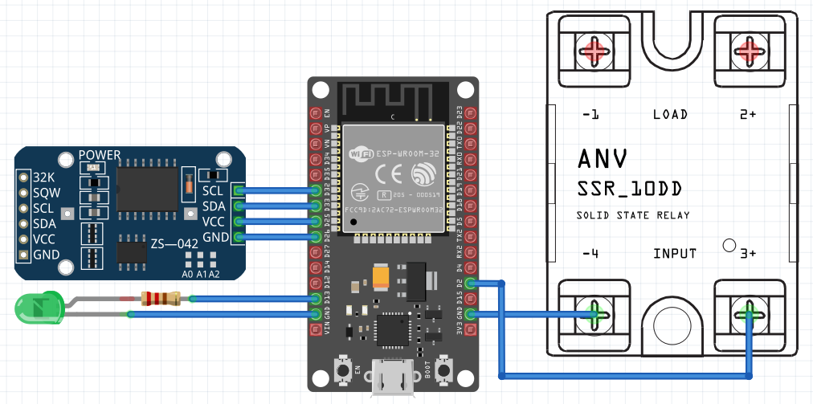

# Automatic School Bell Timer
WARNING SOME SECTIONS ARE NOT READY YET, IN A FEW DAYS THIS MESSAGE WILL BE REMOVED

# gia na min sozei tin katastasi ton PIN se kathe ON OFF
SetOption0 0



### WARNING
**WORKING WITH MAINS VOLTAGE IS VERY DANGEROUS. KEEP ALL PRECAUTIONS AND DO IT AT YOUR OWN RISK.** Ask a licenced technician to do the mains connection.

### Goals
- Very accurate, using NTP(Network Time Protocol). This also means that the time never needs to be set manually.
- Time Zone and Automatic Daylight Savings Time.
- Resistant to Network disconnections and power outages. The module keeps accurate time on such occasions, and only needs to connect the Internet to fix the time drift (less than 1 sec per week without Internet). We use a dedicated DS3231 module(backed by a lithium coin cell) for this.
- Easy to control via PC or mobile.
- With the option of MQTT, it can also be monitored and controlled outside of the local network.
- Ability to use more than 1 timetables even different bells (see dedicated paragraph)
- As few parts as possible, no PCB, and no soldering at all (if we choose an ESP32 board with presoldered headers).
- Reliable hardware. It is expected to work for years and years to come. The minimal part count and the airtight enclosure is hepling on this.
- Reliable software. Minimal dependencies on external services. It can tolerate power outages and MONTHS of WIFI anavailability before the time drift becomes noticeable. The CR2032 coin cell will probably work for 10 years and probably more (discharges only when not in mains power). There is no dependency for MQTT server, whom we dont now if it is working or even exists years later (see the dedicated section for MQTT).
- Very low cost (See the list with materials below)
- Free software. Both tasmota and the berry script are open source with very permissive licences.

### Step 1. Connect the electronic parts just like the above schematic.
The instructions and the pinout are for the DEVkit-30pin board(is ESP32 based). For other boards see the dedicated section below, especialy what Pins you can use. A [terminal adapter](https://duckduckgo.com/?q=esp32+screw+terminal+adapter&t=lm&iar=images&iax=images&ia=images) can make the assembly even easier. We need the ESP32 board, a DS3231 module a Solid state relay, 1 or 2 optional LEDs (they can be bought ready precabled with the resistor) and a quality USB **DATA** cable.

Note that I only have tested (and I have tested it for years) the project with o [FOTEK Solid state relay](https://duckduckgo.com/?q=fotek+ssr&t=h_&iar=images&iax=images&ia=images). It should work with a [5V Relay breakout](https://duckduckgo.com/?q=5V+Relay+breakout+single&t=lm&iar=images&iax=images&ia=images) (Not tested). See the section **Relays and SSR** for more info. Although unlikely both can have failures so it is not a bad idea to have a spear SSR/relay. There are rumors on internet, that say that a solid state relay rated with more current can withstand more abuse from the electromechanical bells, simply because the thyristor inside is bigger. Probably a varistor will help, I leave this for the future.

### Step 2. Tasmota installation.
This is a very short guide, for more info go to the Tasmota installation page.

Connect the ESP board with the USB cable to your computer. Tasmota supports a very convenient web based installer, there is no need to install anything in your computer apart from the browser. **You may need to press the boot button when plugging the ESP board to the computer.** Linux users may get serial permission error, you have to add yourself to the "dialout" group.

- Go to https://tasmota.github.io/install/ (Or simply search for ["tasmota intaller"](https://duckduckgo.com/?t=h_&q=tasmota+installer)). Tasmota(english) is the safest option.

- Press the connect button → choose the serial port → check "Erase Device" → Next → Install (a boot button press might needed)
- After the installation is complete press Next → Configure WIFI.

  Use the current WIFI, even if it is going to be different at the end. When we move to the final location we can change the Access Point.

- When connected, click Visit Device.
  Write down the IP address. This is the web page of the tasmota system. It is accessible from the LAN.
  
- From now on we are working via the browser. We will use a serial connection, only when we want to change Wifi.

- Set the TimeZone/Dayligtht settings.
  Go to [Tasmota Timezone Table](https://tasmota.github.io/docs/Timezone-Table/). Copy the necessary line and execute it in Tools → Console. (NOT berry console).

  execute the "time" command
 
  You will see the time changing to your local time.

- Again in console (and dont forget the "backlog")
  ```berry
  backlog hostname school; SetOption55 1
  ```
  The module will restart automatically and on boot messages(web console), you will see something like
  
  mDN: Initialized "school.local"
  
  From now on you can type "school.local" in the browser address bar instead of the IP. This is not very reliable unfortunatelly, keep also the IP.

###  Step 3. Pin configuration
WebBrowser → IP address (or school.local) → Configuration → Module

For boards other than DevKit of course you need to adapt the pin configurtion. As you can see we have used D25 and D26 to power the DS3231(needs only about 4mA).
```
#### For the DS3231 module #########
GPIO 25 -> OutputHi (acts as VCC)
GPIO 26 -> OutputLow (acts as GND)
GPIO 32 -> I2C SCL
GPIO 33 -> I2C SDA (Be careful NOT SPI SDA)

#### For the indicating LED #####
GPIO 13(D13) -> LedLink_i
# GND is next to D13
```
WARNING the pin of the SSR(D4) is NOT set in the Tasmota configuration. We will set this later on in "autoexec.be"

### Step 4. Loading the DS3231 real time clock driver.
Without this it is easy for the module to lose the time, on power outages and/or unstable Wifi. Installation instructions on:

[DS3231 Driver](https://github.com/pkarsy/TasmotaBerryTime/tree/main/ds3231)

Basically you save the driver "ds3231.be" in the tasmota filesystem, and you load it automatically using "autoexec.be"

### Step 5. Berry script installation ("timetable.be")
This program is implementing the timer engine and the web configuration page.

WebBrowser → IP address (or school.local) → tools → Berry scripting console

paste and execute the following code:

```berry
do
  var fn = 'timetable.be'
  var cl = webclient()
  var url = 'https://raw.githubusercontent.com/pkarsy/AutomaticSchoolBellTimer/refs/heads/main/' + fn
  cl.begin(url)
  if cl.GET() != 200 print('Error getting', fn) return end
  var s = cl.get_string()
  cl.close()
  var f = open('/'+fn, 'w')
  f.write(s)
  f.close()
  print('Installed', fn)
end
```

Now you have the "timetable.be" script installed.

Without leaving the Berry Console, write:

```berry
TTPIN = 4 ### pin D4
load('timetable')
```

You will see the timetable starting, using some defaults. To be started on every boot, it needs to be in "autoexec.be"

tools → Manage filesystem → edit "autoexec.be" (the white icon with the pencil). You have probably already created the file in DS3231 step, otherwise create it now.

Append thelines.
```berry
load('ds3231') # From the DS3231 step
TTPIN = 4
load('timetable')
```

Restart(MainMenu → Restart) the module and go with the browser to the same IP address(or school.local) as previously. You will see a "School Timer" button on top. This is the configuration page of the School Timer. When testing choose * (=ALL) for active days. For real usage, most probably the setting will be 1-5 (Monday-Friday). MON-FRI also works. Note that most/all Relays and SSRs have a LED so we can visually check whether they activated, without connecting the load. This is important because the load is 230/110V and we want to connect it only the last minute at the installation site. Before going to the next step be sure the timer is working as expected.

### Step 6. Collecting the rest of the hardware.
PHOTO-TODO
- A project enclosure, better to be air tight, to prevent moisture and dust. 
- A few jumper cables (2.54 spacing). Use only unused cables, you have been warned.
- Alternativelly a Devkit screw terminal breakout and simple copper wires.
- A usb charger. No need to be powerful, but it helps to be of good quality, for example from an old phone.
- A connector for the bell connection. PHOTO TODO
- ON/OFF switch. The switch will be in series with the bell.
- Dual tape, hot glue, or anything you prefer to fix things inside the box.

### Step 7. Assembling the circuit NEED WORK TODO
For the usb cable you will neet to open a hole like this and then use some Hot glue/Epoxy putty to fix the cable inside the hole.
TODO photo
Check the assembled box
Connect the USB cable with the PC and check the functionality of the module. If you have not set the taimetable parameters yet, probably this is a good time to do so.

### Step 8. Protect the web interface from anauthorized access
Set a Tasmota Web Admin Password to access the page. school.local(or IP) → Configuration → Other → Web Admin Password (Username is "admin"). The page is not encrypted, so not very secure, but it is on LAN only, so I guess is OK. be sure to keep the password written in a safe place.

### Step 9. Install the electrical connector (near the manual bell switch) NEED WORK TODO
SWITCH OFF THE POWER OF THE electrical bells. Usually there is a dedicated switch in the electrical table.

PHOTO
Most probably the school already has a circuit for the bell, and a wall button for manual ringing. In that case the most straitforward way is to install the connector 2 cables at the 2 poles of the switch. With this configuration the Bell rings whenever the SSR/Relay is activated. There is no need to uninstall the old timer (if exists), just disable it.
Or if you are sure you can completely remove the old timer, use the 2 wires for our Relay.
TODO
Plug the Timer connector in the newly installed connector.
Make sure that there is a wall electrical socket for the usb charger **DEDICATED** for this purpose. You do not want someone unpluging the timer, to charge a phone or whatever.

### Step 10. Reconfigure WIFI to use the new AccessPoint.

**Plug the USB cable to your computer** (chromium based browser) and type "tasmota installer" We will use the same tasmota installer.
type Connect and choose the port.
"Configure Wifi" does not always work.

The most reliable way is to use the Logs & Console
```sh
backlog ssid1 MyNewAP; password1 MyNewPassword
```
Instead of the browser you can use any serial terminal like gtketrm however in this case ENTER does not always work, the most succesfull keypress is Ctrl-J

Wait the module to reset and wait to see if connection works. You will see the new IP(the school.local should also work)

Unplug the cable from the laptop and use the USB charger. Connect to the Timer using the tasmota web interface (IP or school.local) You can review the settings of the timer, as from now on is ready for work.

### Last Step. Document the recovery process
Document to a paper and/or to an app, how to recover from a missing/changed Access Point.

Congratulations !

**############## Optional topics, some of them may be of interest to you. ##############**

### More responsive Web Interface
Console(Web or Serial):
```sh
backlog sleep 0; restart 1;
```
the module draws more current but the current is generally very small. (40mA vs 70mA on loli32 lite).

### How to power OFF the ESP32
Unplug the USB charger. The ON/OFF button as we have seen, only disables the output of the Relay.

### How to disable the bell by software.
**DO NOT DO THIS.** The timer should be used by anyone from the personell. Use the ON/OFF button for this task. If you really insist on doing this by software, set the duration to 0. The ON/OFF button will not have any effect of course if duration==0.

### More than 1 timetable/bells
in autoexec.be we write
```sh
TTPIN = 4
TTPIN2 = 4 # Can be the same (= the same bell) or different pin (= different SSR and Bell)
load('timetable')
```
The second timetable can be (for example) an additional class on Friday afternoon.

TTPIN3 TTPIN4 TTPIN5 also work (highly unlikely that you ever need them).

### No Manual "RING" button ?
This is the job of a wall button, indepedent of our timer.

### Disable Device Recovery (Recommended)
A generally usefull function, however it can result in unexplained device reset, if the wall power is unreliable.
Go to Tools → Console
```sh
backlog SetOption65 1; restart 1;
```

### MQTT server, optional but useful for debugging and remote control
There are a lot of online MQTT servers free and paid and may you prefer this instead of hosting your own. Examples are (there are more):
- hivemqtt.com
- flespi.com

You must use the TLS connection, all online servers support secure connections. **If you are not using TLS better do not use MQTT at all**

You will also need an mqtt-client such as:

- MQTT-Explorer
- MQTTX
- (lots of terminal clients)
- (android clients)
- (android termux clients)

In tasmota console, we enable MQTT :
```sh
setoption3 1
```
after restart paste the following commands, modified of course for your MQTT server.
```sh
backlog topic school; setoption132 1; SetOption103 1; MqttHost mqtt.hostname.io; MqttPort 8883 ; MqttUser myusername ; MqttPassword mypassword;
```

The module will again restart and this time you should see the module connecting and sending status messages to the server. There are lots of things you can do with MQTT but for this specific project you can use the following commands :

| publish topic | payload       | action | response topic |
| ------------- | ------------- | ----- | ------- |
| cmnd/school/br | tt.bell_on() | rings the bell | stat/school/RESULT |
| cmnd/school/br | tt.timetable | shows the timetable | stat/school/RESULT |
| cmnd/school/br | tt.set_timetable("1000 1045")| sets the timetable | stat/school/RESULT |
| cmnd/school/br | tt.duration | shows the duration | stat/school/RESULT |
| cmnd/school/br | tt.set_duration(5) | sets the duration | stat/school/RESULT |
| cmnd/school/br | tt.active_days | shows the active days | stat/school/RESULT |
| cmnd/school/br | tt.set_active_days("1-5") | set the active days | stat/school/RESULT |

There are a lot of mqtt GUI apps on mobile(and Web) allowing to automate theese commands with buttons if you need this, but I think is overkill, given how rarelly you need to change the settings.

### Control the timer with console comands.
You can control the timetable with console(serial console or web console) commands.
```sh
br tt.bell_on()
br tt.set_timetable("1000 1045")
br tt.set_duration(5)
br tt.set_active_days("1-5")
```

### Do I need to update the tasmota system ?
Probably not. If it is working, don't fix it. The same applies for the berry script.

### Why not using the buildin tasmota timers
They are not very convenient for this specific application. Also there are cases ( schools with day+afternoon timetable) where the available timers are not enough. The "timetable.be" script offers an unlimited number of timers and a relatively easy to use web interface.

### 5Ghz wifi. Currrently not working
At the moment all Tasmota supported ESP chips only work with WIFI 2.4 GHz. This is acceptable, as most Access Points support 2.4 GHz and 5GHz at the same time. When the Tasmota system supports 5GHz, for example ESP32-C6, I guess it will be relatively easy to use the new chip.

### Why Tasmota and not an embeded programming language (Arduino, micropython circuitpyton, lua or even ESP-IDF) ?
Tasmota solves for us some very important aspects of the project:

- Network connectivity (this includes WIFI connect and reconnect, optional MQTT client, TLS).
- Keeping the system time always accurate, using the NTP protocol.
- A customizable web server, which allows us to create a dedicated configuration page for the timetable.
- Time Zone and Daylight Time Switching.
- Easy control of peripherals.
- filesystem and settings storage.
- a scripting language, the excellent Berry Language.
- Easy device connection (DS3231 specifically).
- An excellent web based installer. No software is needed for installation (only a chrome based browser) and it is working the same on all operating systems.
- Easy recovery and setting the WIFI credentials using the same tasmota web installer (or any serial terminal if you prefer).

### How Tasmota is getting the time from the Internet.
This crusial operation is performed by the Tasmota system itself and not by the "timetable.be" script.
It is using the ubiquous and ultra reliable NTP protocol. The buildin servers just work, so no need to configure anything.

### Using other boards instead of DevKit
The most important defference between boards is the ESP chip. We have 3 options here: ESP32 ESP32-S2 ESP32-C3

- ESP32 boards(like DevKit) are prefered over ESP32-S2 or ESP32-C3. They always come with a dedicated USB-serial chip (CP2102, CH9102, CH340) and this characteristic allows easy programming and recovering. Ber careful with [the pins you can use.](https://duckduckgo.com/?q=esp32+what+pins+to+use)

- ESP32-C3. I have witnessed some instability whith C3(at 2025) : When the ESP32-C3 does not find an AccessPoint, frequently crashes. It recovers immediatelly but lets stay on the safe side. Some boards do not have Serial hardware creating headaches with installation and recovering.

- ESP32-S2. No Hardware Serial. Some boards come without PSRAM and are practically unusable.

- There are many board specific limitations. For example for [ESP32 LOLIN32 Lite](https://duckduckgo.com/?q=ESP32+LOLIN32+Lite&iax=images&ia=images): The battery charger must not be used, no 5V output for a relay. Only 1 GND pin (we can simulate VCC and GND with GPIO pins)

- Avoid tiny boards no matter how cute they are, almost always are missing crusial parts like Serial, GND etc.

- ESP8266 boards do NOT work. They cannot run the Berry interpreter.

### Solid state Relays

- They work on specific conditions ususally only AC or only DC, and specific voltages. As we are probably talk about mains voltage, you will need a ~230V(or 110) AC relay.
- They only need a GPIO pin and a GND for control (Even this can be simulated by a GPIO, so you can choose the most convenient PINs)
- They usually have a very long life.
- Triac based AC solid relays(most/all AC models ?) are very well suited for inductive loads (electromechanical bells).
- They cannot completly cut the power, allowing some mA to leak. For electromechanical bells this is OK, but I dont know about other uses. Also check the manual if this tiny mA leak has some safety implications.

### Electromechanical relays
you have to use a [5V relay breakout board](https://duckduckgo.com/?q=5v+relay+breakout+single&t=h_&iar=images&iax=images&ia=images),

- They needs a +5V a GPIO and a GND(not a GPIO)
- They work for AC and DC and and A wide range of voltages.
- Generally not well suited for inductive loads. (electromechanical bells) I imagine not all relays are the same, but this is a general rule.

### Problems with existing solutions/ reasons this project is created
Before creating this project I have tested a lot of timers. The limitations were very severe, and I document them here without particular order.

- Very limited number of timers, usually smaller than the 14-20 a school needs.
- Hard to use, almost unusable hardware control panel.
- Severe time drift. This basically means constant maintenance and/or that the bell never rings at the expected time. A few minutes/even seconds error does not seem to be a problem at first glance, but the real problem is the argument with the students that the time is passed that they are gonna loose the bus etc.
- Not capable of switching to Daylight savings time. Even WIFI plugs have problems on this.
- Computer based solutions suffer from complexity and unreliability. Operating system updates, broken harware, high electricity consumption, audio equipment maintainance, are some of the drawbacks.
- Wall WIFI plugs like TUYA, sonoff etc have almost always the problem with limited number of timers. Every one needs a different mobile application, and they can ONLY be controlled by their modile app.
- Especially WIFI plugs cannot be used as [dry(no voltage) contacts](https://en.wikipedia.org/wiki/Dry_contact) (See **electrical connection**).
- Wifi based timers do not have internal battery backed RTC, and without network, will lose the time.
- Limited/No protection from moisture and dust.

### Another solution to protect the web page(additonally/instead of password).
Use a wifi Access Point which is dedicated for the bell. This can be an old unused acces point. This way any changes to the primary network do not disturb the bell. To be able to access the Tasmota Web Page you have to connect to the same AP, so you have to keep the AP/passord somewere. Or it can be a second("Guest") access point available via the configuration page of many commercial Access Points.

