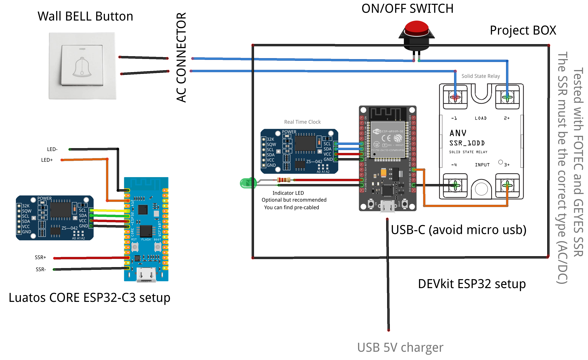

# Automatic School Bell Timer



### WARNING
⚡🚨 **WORKING WITH MAINS VOLTAGE IS VERY DANGEROUS. KEEP ALL PRECAUTIONS AND DO IT AT YOUR OWN RISK.** Ask a licenced technician to do the mains connection. The AC connector (schematic) should be connected ONLY after assembling fully the parts and the project BOX is closed.🚨⚡

### Characteristics

- Very accurate, using NTP(Network Time Protocol). The time never needs to be set manually.

- Time Zone and Automatic Daylight Savings Time.

- Resistant to Network failures and power outages. The module keeps accurate time, and only needs the Internet to fix the time drift (less than 1 sec per week). We use a dedicated DS3231 module(backed by a lithium coin cell) for this.

- Easy configuration via PC or mobile.

- Very few parts (see the schematic). Easy assembly and low cost.

- No PCB, and no soldering at all (if we bye a ESP32x board with presoldered headers).

- Reliable hardware. It is expected to work for many years. The minimal part count and the airtight enclosure is hepling on this.

- With  (optional) MQTT, it can also be monitored and controlled outside of the local network.

- (Rarelly needed) Ability to use more than 1 timetables even different bells.

- Free software. Both tasmota and the berry script are open source with very permissive licences.

### Step 1. Connect the electronic parts just like the above schematic.
The instructions and the pinout are for the DEVkit-30pin/38 pin boards (ESP32 based). For other boards see the dedicated section below, especialy what Pins you can use. A [terminal adapter](https://duckduckgo.com/?q=esp32+screw+terminal+adapter&t=lm&iar=images&iax=images&ia=images) can make the assembly even easier. We need the board (prefer USB-C. The older micro-usb is unreliable), a DS3231 module a Solid state relay, 1 optional LED (can be bought ready precabled with the resistor) and a quality USB **DATA** cable.
For the software installation/testing you can replace temporarilly the Relay with a LED. If you connect directly the SSR, **make sure do not connect any mains load to it.** Almost all have a LED buildin so you can know when it is activated.

### Step 2. Tasmota installation.
This is a short guide, for more info go to the Tasmota installation page.

Connect the ESP board with the USB cable to your computer. Tasmota supports a very convenient web based installer, there is no need to install anything on your computer. Linux users may get serial permission error, you have to add yourself to the "dialout" group.

- Go to https://tasmota.github.io/install/ (Or simply search for ["tasmota intaller"](https://duckduckgo.com/?t=h_&q=tasmota+installer)). Tasmota(english) is the safest option.

- Press the connect button → choose the serial port → check "Erase Device" → Next → Install (**a ESP boot button press might needed**)

- After the installation is complete press Next → Configure WIFI. If you cannot communicate with the board, reset and reconnect. For other configuration methods see the Tasmota installation page.

-  Use the current Access Point, even if it is going to be different at the end. When we move to the final location we can change the Access Point.

- When connected, click Visit Device.
  Write down the IP address.It is something like 192.168.1.xx for home routers. This is the web page of the tasmota system. It is accessible from the LAN.
  
- **From now on we are working from the browser using the IP address. We will need a serial connection (USB cable) again, if we want to change Wifi.**

- Set the TimeZone/Dayligtht settings.
  Go to [Tasmota Timezone Table](https://tasmota.github.io/docs/Timezone-Table/). Copy the necessary line and paste + execute it in Tools → Console. (NOT berry console).

  execute the console "time" command.
 
  You will see the time changing to your local time.

- Again in console (and dont forget the "backlog"), various important settings
  ```berry
  Backlog SetOption53 1; SetOption65 1; SetOption36 0 ;SetOption55 1; SetOption56 1; SetOption0 0; WifiConfig 5; PowerOnState 0;
  ```
  Replace  the "school" with the schools name, but only use latin allphanumeric characters.
  ```berry
  backlog DeviceName school; FriendlyName school; Topic school ; Hostname school; mqttlog 2; mqttclient school-%06X;
  ```
  The module will restart automatically and on boot messages(web console), you will see something like
  
  mDN: Initialized "school.local"
  
  From now on you can type "school.local" in the browser address bar instead of the IP. This is not very reliable unfortunatelly, keep also the IP.

###  Step 3. Pin configuration
WebBrowser → IP address (or school.local) → Configuration → Module

Adjust the pin configurtion for your ESP board. As you can see we have used D25 and D26 to power the DS3231(needs only about 4mA). This allows easy cabling. Use real VCC and GND if you prefer.

**DevKit (schematic)**
```
#### DS3231 module
GPIO 25 → OutputHi (acts as VCC)
GPIO 26 → OutputLow (acts as GND)
GPIO 32 → I2C SCL
GPIO 33 → I2C SDA (Be careful NOT SPI SDA)

#### Indicating LED (Optional)
GPIO 13(D13) → LedLink_i
# GND is next to D13 id we use DevKit
## SSR/Relay
GPIO 4 → Relay(1)
```

**alternative build with Luatos ESP32-C3 board (schematic)**
```
GPIO 4 → I2C SCL
GPIO 5 → I2C SDA (Be careful NOT SPI SDA)
GPIO 9 → LedLink_i
GPIO 2 → Relay(1)
```

Save the settings and the module will reboot. If you have installed the LED you will see it blinking until the boot process is complete. When the module connects to the Wifi, the LED will stay active indicating everything is OK.

### Step 4. Loading the DS3231 real time clock driver.
The driver lives in this [github page](https://github.com/pkarsy/TasmotaBerryTime/tree/main/ds3231), for convenience however, I include the installation instructions here:

WebBrowser → IP address (or school.local) → tools → Berry scripting console

Paste and execute the following code:
```berry
do
  var fn = 'ds3231.be'
  var cl = webclient()
  var url = 'https://raw.githubusercontent.com/pkarsy/TasmotaBerryTime/refs/heads/main/ds3231/' + fn
  cl.begin(url)
  if cl.GET() != 200 print('Error getting', fn) return end
  var s = cl.get_string()
  cl.close()
  var f = open('/'+fn, 'w')
  f.write(s)
  f.close()
  print('Installed', fn)
end
```

Now you have the driver "ds3231.be" in the tasmota filesystem. Whithout leaving the console
```berry
load('ds3231')
```
and hopefully you will see the driver finding the module. If the driver cannot find the DS3231 chip, either the cabling is incorrect, or the pins are not configured correctly in the tasmota configuration page.(See the previous step). **No need to set the DS3231 time, the driver will do it for you.**

### Step 5. Berry script installation ("timetable.be")
This script is implementing the timer engine and the web configuration page.

Again in Berry console paste and execute the following code:

```berry
do
  var fn = 'timetable.be'
  var cl = webclient()
  var url = 'https://raw.githubusercontent.com/pkarsy/AutomaticSchoolBellTimer/refs/heads/main/' + fn
  cl.begin(url)
  if cl.GET() != 200 print('Error getting', fn) return end
  var s = cl.get_string()
  cl.close()
  var f = open('/'+fn, 'w')
  f.write(s)
  f.close()
  print('Installed', fn)
end
```

Now you have the "timetable.be" script installed.

Without leaving the Berry Console, write:

```berry
load('timetable')
```
You will see the timetable starting, using some defaults.


## step 6. Load the scripts automativally on boot

tools → Manage filesystem 
Edit "autoexec.be" **(the white icon with the pencil)** if the file exists, otherwise create it yourself.

Append the lines.
```berry
load('ds3231') # for the DS3231

load('timetable') # for the timetable
```
And save.

Restart(MainMenu → Restart) the module and go with the browser to the same IP address(or school.local) as previously. You will see a "School Timer" button on top. **This is the configuration page of the School Timer.** For the active days the correct setting is almost certainly 1-5 or MON-FRI. For tests you can set it to * (means ALL days even weekend) but set it correctly before actual use. Set an alarm for the next minutes and check that it is working.

### Step 6. Collecting the rest of the hardware.
As you can see (schematic) you will need a few more parts to complete the project.
- A few jumper cables (2.54 spacing). Use only unused cables, you have been warned.
- Alternativelly a Devkit screw terminal breakout and simple copper wires.
- A usb charger. No need to be powerful, but it helps to be of good quality, for example from an old phone.
- A connector for the bell connection.
- ON/OFF switch. This enables/disables the timer.
- A project enclosure, better to be air tight, to protect from moisture and dust. Do not try to use a very small box, better to have some room to put the parts well organized and with the SSR and AC cables in some distance. Be prepared to open some holes for the cables, LED, switch and some way(for example hot glue, epoxy, tape) to fix all. There are excellent online tutorials on how to do this.

### Step 7. Protect the web interface from anauthorized access
Set a Tasmota Web Admin Password to access the page. school.local(or IP) → Configuration → Other → Web Admin Password (Username is "admin"). The page is not encrypted, so not very secure, but it is on LAN only, so I guess is OK. be sure to keep the password written in a safe place.

### Step 8. Install the electrical connector
AGAIN BE CAREFUL, THIS IS ELECTRICAL WORK.
SWITCH OFF THE POWER OF THE electrical bells. Usually there is a dedicated switch in the electrical table.
Almost certainly the school already has a wall button for the bell. In that case the most straitforward way is to install the connector 2 cables at the 2 poles of the switch. With this configuration the Bell rings whenever the SSR/Relay is activated. There is no need to uninstall the old timer (if it exists), just disable it.

### Step 9. Reconfigure WIFI to use the new AccessPoint.
If you have configured the wifi before at home, you have to reconfigure it to use the new AccessPoint.
**Plug the USB cable to your computer** (chromium based browser) and use the same tasmota installer.
"Configure Wifi" does not always work.

The most reliable way is to use the "Logs & Console"
```sh
backlog ssid1 MyNewAP; password1 MyNewPassword
```
For the tinkerers : Alternatively you can use a serial terminal like gtketrm, however in this case, instead of ENTER you may need Ctrl-J

Wait the module to reset and wait to see if connection works. You will see the new IP(the school.local should also work)

Unplug the cable from the laptop and use the USB charger. Connect to the Timer using the tasmota web interface (IP or school.local) You can review the settings of the timer, as from now on is ready for work.

### Last Step. Document the recovery process
Document to a paper and/or to an app, how to recover from a missing/changed Access Point. Keep in a folder on your PC:
A photo of the timer (ESP32x and cabling)
The pins configuration (as simple text)
The wifi configuration (ssid, password, maybe IP if it is static)


### Congratulations !


## Optional topics, some of them may be of interest to you.

### How to power OFF the ESP32
Unplug the USB charger. The ON/OFF button as we have seen, only diconnects the Relay output.

### More than 1 timetable/bells
Generally Works, It will documented when it is ready.
```
global.start_timetable(2)
```
The second timetable can be (for example) an additional class on Friday afternoon.

### No Manual "RING" button ?
This is the job of a wall button, independent of our timer. All schools I know have one.

### MQTT server, optional but useful for debugging and remote control
There are a lot of online MQTT servers free and paid and you may prefer them instead of hosting your own. Examples are (free, and there are more):
- hivemqtt.com
- flespi.com

You must use the TLS connection, all online servers support secure connections. **If you are not using TLS better do not use MQTT at all**

You will also need an mqtt-client such as:

- MQTT-Explorer
- MQTTX
- (lots of terminal clients)
- (android clients)
- (android termux clients)

In tasmota console, we enable MQTT :
```sh
setoption3 1
```
after restart paste the following commands, modified of course for your MQTT server.
```sh
backlog topic school; setoption132 1; SetOption103 1; MqttHost mqtt.hostname.io; MqttPort 8883 ; MqttUser myusername ; MqttPassword mypassword;
```

The module will again restart and this time you should see the module connecting and sending status messages to the MQTT server.

| publish topic | payload       | action | response topic |
| ------------- | ------------- | ----- | ------- |
| cmnd/school/br | tt1.bell_on() | rings the bell | stat/school/RESULT |
| cmnd/school/br | tt1.timetable | shows the timetable | stat/school/RESULT |
| cmnd/school/br | tt1.set_timetable("1000 1045")| sets the timetable | stat/school/RESULT |
| cmnd/school/br | tt1.duration | shows the duration | stat/school/RESULT |
| cmnd/school/br | tt1.set_duration(5) | sets the duration | stat/school/RESULT |
| cmnd/school/br | tt1.active_days | shows the active days | stat/school/RESULT |
| cmnd/school/br | tt1.set_active_days("1-5") | set the active days | stat/school/RESULT |

There are a lot of mqtt GUI apps on mobile(and Web) allowing to automate theese commands with buttons if you need this, but I think is overkill, given how rarelly you need to change the settings.

### Control the timer with console comands.
You can control the timetable with console(serial console or web console) commands.
```sh
br tt1.bell_on()
br tt1.set_timetable("1000 1045")
br tt1.set_duration(5)
br tt1.set_active_days("1-5")
```

### Do I need to update the tasmota system ?
Probably not. If it is working, don't fix it. The same applies for the berry script.

### Why not using the buildin tasmota timers
They are not very convenient for this specific application. Also there are cases ( schools with day+afternoon timetable) where the available timers are not enough. The "timetable.be" script offers an unlimited number of timers and a relatively easy to use web interface.

### 5Ghz wifi. Not working but not a big deal.
At the moment all  ESP chips only work with WIFI 2.4 GHz. This is OK, as most Access Points support 2.4 GHz and 5GHz at the same time, just be sure to enable it. When 5GHz chips will be available, it will be trivial to include them.

### Why Tasmota and not an embeded programming language (Arduino, micropython circuitpyton, lua, ESP-IDF, toit) ?
Tasmota acts as an operating system and solves for us some very important aspects of the project:

- Network connectivity (this includes WIFI, TLS , optional MQTT client, and of course credentials storage).
- Keeping the system time accurate, using the NTP protocol.
- A customizable web server, which allows us to create easily a configuration page.
- Time Zone and Daylight Time.
- Easy control of peripherals.
- filesystem and settings storage.
- a scripting language, the excellent Berry Language.
- Easy device connection (DS3231 specifically).
- An excellent web based installer. No software/programming environment is needed for installation (only a browser) and it is working the same on all operating systems.
- Easy recovery using the same tasmota web installer (or any serial terminal if you prefer).

### How Tasmota is getting the time from the Internet.
This crusial operation is performed by the Tasmota system itself and not by the "timetable.be" script.
It is using the ubiquous and ultra reliable NTP protocol. The default servers just work, so no need to configure anything.

### Notes on using various boards

Older boards use micro-usb, but it is not very reliable. Invest in a USB-C board. The cable should be of good quality and be DATA(4pins) Most usb cables coming with various appliances are only charging cables, be careful

The most important difference between boards is the ESP chip. We have 3 options here: ESP32 ESP32-S2 ESP32-C3

- ESP32 boards(like DevKit) are OK. They always come with a dedicated USB-serial chip (CP2102, CH9102, CH340) and this characteristic allows easy programming and recovering. Ber careful with [the pins you can use.](https://duckduckgo.com/?q=esp32+what+pins+to+use). One problem is most of the boards on online stores still use micro-usb. Ensure the board to have USB-C

- ESP32-C3. It is also OK and the Wifi performance is the best. Some boards do not have Serial hardware but again the are very reliable. I have tested Luatos ESp32-C3 and WeAct ESP32-C3. They are both OK. Almost all boards come with USB-C(this is good)

- ESP32-S2. No Hardware Serial. Some boards come without PSRAM and are practically unusable as S2 comes with very limited buildin RAM. I find the web interface very laggy, and the USB frequently dissapears. Also setting the board to programming mode can be difficult. If you have a board with dedicated serial chip, it might be OK, but I generally cannot see the point to use ESP32-S2 for this specific project.

- There are many board specific limitations. For example for [ESP32 LOLIN32 Lite](https://duckduckgo.com/?q=ESP32+LOLIN32+Lite&iax=images&ia=images): Is micro-usb. The battery charger must not be used, no 5V pin for a relay(SSD works fine). Only 1 GND pin (we can simulate VCC and GND with GPIO pins)

- Generally avoid tiny boards no matter how cute they are, almost always are missing crusial parts like GND. But most importantly some/all use Chip Antennas. Some sources claim it can be OK, but I disagree, the 2 different chip antenna boards I have tested, perform very poorly (2 meters range, unusable for the bell timer). If you are insisiting on using chip antenna, first check the reviews for this specific board. On the contrary PCB antenna boards are usually fine.

- ESP8266 boards do NOT work. They cannot run the Berry interpreter.

### Relay types
Note that I only have tested the project with a [FOTEK Solid state relay](https://duckduckgo.com/?q=fotek+ssr&t=h_&iar=images&iax=images&ia=images). and GEYES. It should work with a [5V Relay breakout](https://duckduckgo.com/?q=5V+Relay+breakout+single&t=lm&iar=images&iax=images&ia=images) (Not tested). Both can have failures, so it is not a bad idea to have a spear SSR/relay. There are discussions on internet, that say that a solid state relay rated with more current can withstand more abuse from the electromechanical bells. You can protect the SSR/Relay using a MOV/TVS diode. TODO

### Solid state Relays

- They work on specific conditions ususally only AC or only DC, and specific voltages. As we are probably talk about mains voltage, you will need a ~230V(or 110) AC SSR.
- They only need a GPIO pin and a GND for control (Even this can be simulated by a GPIO, so you can choose the most convenient PINs)
- They usually have a very long life. If we protect the output pins with a MOV/TVS diode, the life expectancy is even higher.
- Triac based AC solid relays(most/all AC models ?) are very well suited for inductive loads (electromechanical bells).
- They cannot completly cut the power, allowing some mA to leak. For electromechanical bells this is OK, but I dont know about other types. Also check the manual if this tiny mA leak has some safety implications.

### Electromechanical relays
you have to use a [5V relay breakout board](https://duckduckgo.com/?q=5v+relay+breakout+single&t=h_&iar=images&iax=images&ia=images),

- They needs a +5V a GPIO and a GND(not a GPIO)
- They work for AC and DC and and a wide range of voltages.
- Generally not well suited for inductive loads. (electromechanical bells) I imagine not all relays are the same, but this is a general rule.

### Problems with existing solutions/ reasons this project is created
Before creating this project I have tested a lot of timers. The limitations were very severe, and I document them here without particular order.

- Very limited number of timers, usually smaller than the 14-20 a school needs.
- Hard to use, almost unusable hardware control panel.
- Severe time drift. This basically means constant maintenance and/or that the bell never rings at the expected time. A few minutes/even seconds error does not seem to be a problem at first glance, but the real problem is the argument with the students that the time is passed that they are gonna loose the bus etc.
- Not capable of switching to Daylight savings time. Even WIFI plugs have problems on this.
- Computer based solutions are overkill and suffer from complexity and unreliability. Operating system updates, broken hardware, high electricity consumption, audio equipment maintainance, are some of the drawbacks.
- Wall WIFI plugs like TUYA, sonoff etc have almost always the problem with limited number of timers. Every one needs a different mobile application, and they can ONLY be controlled by their modile app.
- Especially WIFI plugs cannot be used as [dry(no voltage) contacts](https://en.wikipedia.org/wiki/Dry_contact) (See **electrical connection**). Usually this alone is a deal braker.
- Wifi based timers do not have internal battery backed RTC, and without network even temporarily, will lose the time.
- Limited/No protection from moisture and dust.

### Another solution to protect the web page(additonally/instead of password).
Use a wifi Access Point which is dedicated for the bell. This can be an old unused acces point. This way any changes to the primary network do not disturb the bell. To be able to access the Tasmota Web Page you have to connect to the same AP, so you have to keep the AP/password somewere. Or it can be a second("Guest") access point available via the configuration page of many commercial Access Points.

