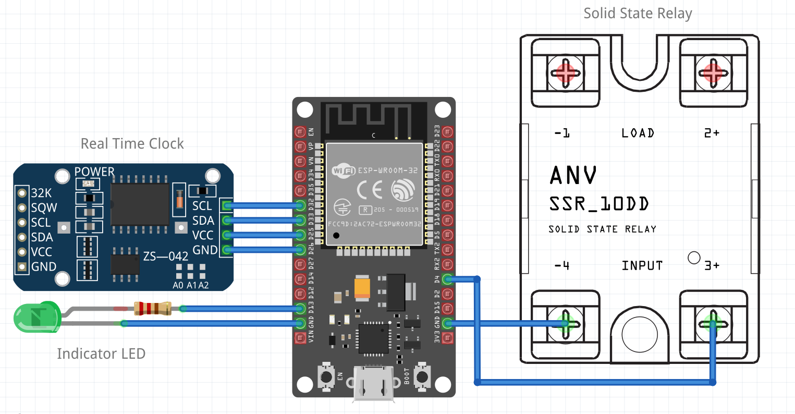

# Automatic School Bell Timer  

**Notice:** Some sections (e.g., hardware assembly photos, detailed instructions) are still in progress. However, the guide is complete enough to build the hardware. I’ll update the page soon.  

  

### ⚠️ WARNING  
**WORKING WITH MAINS VOLTAGE IS DANGEROUS.** Always follow safety precautions and perform connections **only if qualified**. Otherwise, hire a licensed electrician.  

---

### 🔍 Key Features  
- **High accuracy** via NTP (Network Time Protocol)—**no manual time setting needed**.  
- **Automatic Time Zone & Daylight Savings adjustments**.  
- **Resilient to outages**:  
  - Uses a **DS3231 module** (with lithium coin cell backup) to maintain time during power/Wi-Fi failures (<1 sec drift/week without internet).  
- **Easy setup** via PC/mobile.  
- **Minimal parts**: No PCB or soldering required (if using an ESP32 board with pre-soldered headers).  
- **Reliable hardware/software**:  
  - Airtight enclosure for durability.  
  - Tolerates power/Wi-Fi outages for **months** without significant drift.  
  - CR2032 battery lasts **~10 years** (only discharges during power loss).  
- **Low cost** (see materials list below).  
- **Optional MQTT** for remote monitoring/control (no dependency for normal operation).  
- **Supports multiple timetables/bells** (see dedicated section).  
- **Open-source**: Tasmota and Berry script use permissive licenses.  

---

### 🛠️ Step-by-Step Guide  

#### **Step 1: Assemble Electronics**  
- Follow the schematic for **ESP32 DEVkit (30-pin/38-pin)**. For other boards, check pin compatibility.  
- **Parts needed**:  
  - ESP32 board  
  - DS3231 module  
  - Solid-state relay (SSR)  
  - Optional LED (pre-cabled with resistor)  
  - Quality **USB data cable**  
- **Tip**: Use a [screw terminal adapter](https://duckduckgo.com/?q=esp32+screw+terminal+adapter) for easier assembly.  
- **Testing**: Replace the relay with an LED initially. **Do not connect mains power yet!**  

#### **Step 2: Install Tasmota**  
1. Connect ESP32 to your PC via USB (**press "Boot" button if needed**).  
2. Use the **web installer**:  
   - Visit [Tasmota Installer](https://tasmota.github.io/install/).  
   - Select serial port → Check "Erase Device" → Install.  
3. **Configure Wi-Fi**:  
   - Use current Wi-Fi (can be changed later).  
   - Note the device IP (e.g., `192.168.1.xx`).  
4. **Set TimeZone**:  
   - Copy the correct line from [Tasmota Timezone Table](https://tasmota.github.io/docs/Timezone-Table/) → Paste in **Console** (not Berry Console).  
   - Verify with `time` command.  
5. **Apply critical settings**:  
   ```berry
   backlog SetOption0 0; hostname school; SetOption55 1; SetOption65 1